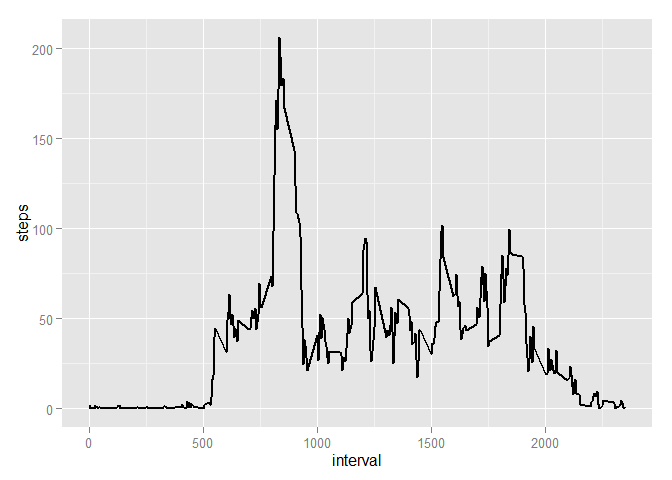
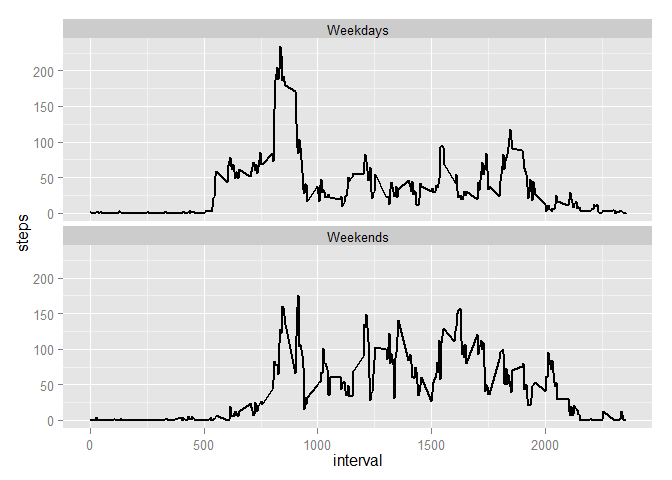

# Reproducible Research: Peer Assessment 1


## Loading and preprocessing the data

```r
## load the packages
library(knitr)
```

```
## Warning: package 'knitr' was built under R version 3.1.2
```

```r
library(lubridate)
library(ggplot2)
```

```
## Warning: package 'ggplot2' was built under R version 3.1.2
```

```r
##Loading data from CSV to the memory for processing.
source.data<-read.csv("./activity.csv")

##process the source data with adding 2 variables (weekdays,t_days)
##weekdays stores the name of weekdays.
##t_days means types of weekdays,that indicate the date is weekday or weekend.
p.data<-source.data
p.data[,c(4,5)]<-""
names(p.data)[c(4,5)]<-c("weekdays","t_days")

##convert the date into the lubricate format and attribute those to either weekdays or weekends
p.data$date<-ymd(p.data$date)
p.data$weekdays<-weekdays(p.data$date,abbreviate=TRUE)
p.data[!(p.data$weekdays%in% c("Sat","Sun")),5]<-"Weekdays"
p.data[(p.data$weekdays%in% c("Sat","Sun")),5]<-"Weekends"
```


## What is mean total number of steps taken per day?

```r
##Summarize the steps by date
sum.bydate<-aggregate(p.data$steps,by=as.data.frame(p.data$date),FUN=sum)

##change the variables' names in the summarized table
names(sum.bydate)<-c("date","steps")

## Display steps by date
p<-ggplot(sum.bydate,aes(x=date,y=steps))
p+geom_histogram(stat="identity")
```

```
## Warning: Removed 8 rows containing missing values (position_stack).
```

 

```r
##Calcuate the mean and median for the dataset which is summarized by all date.
paste("Mean:",round(mean(sum.bydate$steps,na.rm=TRUE)))
```

```
## [1] "Mean: 10766"
```

```r
paste("Median:",median(sum.bydate$steps,na.rm=TRUE))
```

```
## [1] "Median: 10765"
```

## What is the average daily activity pattern?

```r
##Calculate the mean of the steps by interval
sum.byinterval<-aggregate(p.data$steps,by=as.data.frame(p.data$interval),FUN=mean,na.rm=TRUE)

##change the variables' names in the summarized table
names(sum.byinterval)<-c("interval","steps")

## Display steps by interval
p<-ggplot(sum.byinterval,aes(x=interval,y=steps))
p+geom_line(size=1)
```

 

```r
## Display the maximum steps in those interval
paste("Maximum steps is:",sum.byinterval[sum.byinterval$steps==max(sum.byinterval$steps),1])
```

```
## [1] "Maximum steps is: 835"
```

## Imputing missing values
#### The missing values were generated by the following strategy:
#### 1) Create the mean values by interval for the weekdays and weekends respectively.
#### 2) Assign the mean values to those missing days by weekdays and weekends.

```r
##Calcuate the total rows whose value is NA
paste("Total rows of missing value is:",nrow(p.data[is.na(p.data$steps),]))
```

```
## [1] "Total rows of missing value is: 2304"
```

```r
##Calculate the mean of the steps by interval
wd<-p.data[(!is.na(p.data$steps))&(p.data$t_days=="Weekdays"),]
wd.byinterval<-aggregate(wd$steps,by=as.data.frame(wd$interval),FUN=mean,na.rm=TRUE)

##change the variables' names in the summarized table
names(wd.byinterval)<-c("interval","steps")

##round the steps
wd.byinterval$steps<-round(wd.byinterval$steps)

##Create the simulated steps for those days in weekdays
wd.na.date<-unique(p.data[(is.na(p.data$steps)&(p.data$t_days=="Weekdays")),]$date)
wd.len<-length(wd.na.date)
for (x in 1:wd.len)
{
  if (x==1)
    wd.na<-cbind("date"=wd.na.date[x],wd.byinterval)
    else
    wd.na<-rbind(wd.na,cbind("date"=wd.na.date[x],wd.byinterval))
}
wd.na$t_days<-"Weekdays"

##Calculate the mean of the steps by interval for weekend
we<-p.data[(!is.na(p.data$steps))&(p.data$t_days=="Weekends"),]

we.byinterval<-aggregate(we$steps,by=as.data.frame(we$interval),FUN=mean,na.rm=TRUE)

##change the variables' names in the summarized table
names(we.byinterval)<-c("interval","steps")

##round the steps
we.byinterval$steps<-round(we.byinterval$steps)

##Create the simulated steps for those days in weekends
we.na.date<-unique(p.data[(is.na(p.data$steps)&(p.data$t_days=="Weekends")),]$date)
we.len<-length(we.na.date)
for (x in 1:we.len)
{
  if (x==1)
    we.na<-cbind("date"=we.na.date[x],we.byinterval)
  else
    we.na<-rbind(we.na,cbind("date"=we.na.date[x],we.byinterval))
}
we.na$t_days<-"Weekends"

##Combine the simulated data and actual data without NA
s.data<-rbind(we.na,wd.na,p.data[!is.na(p.data$steps),c(2,3,1,5)])

##Calculate the mean of the steps by interval
s.byinterval<-aggregate(s.data$steps,by=s.data[,c(2,4)],FUN=mean,na.rm=TRUE)

##change the variables' names in the summarized table
names(s.byinterval)[3]<-"steps"

s.byinterval$steps<-round(s.byinterval$steps)
```

## Are there differences in activity patterns between weekdays and weekends?

```r
## Display steps by interval
p<-ggplot(s.byinterval,aes(x=interval,y=steps))
p+geom_line(size=1)+facet_wrap(~t_days,nrow=2,ncol=1) 
```

 
